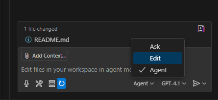
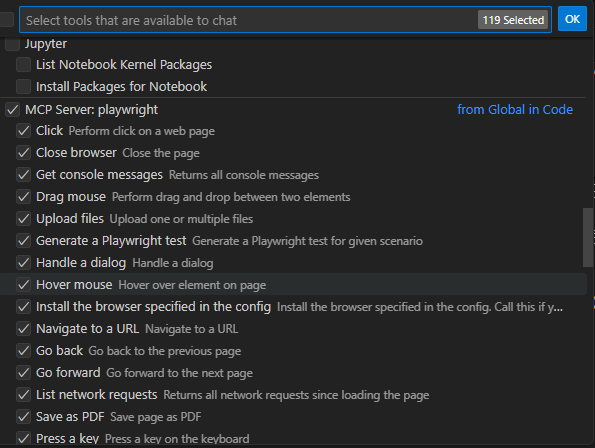

# Playwright Hands Lunch & Learn

Welcome to the Playwright Hands-on & Lunch Learn!  
In this hands-on session, you will learn the fundamentals of UI automation using [Playwright](https://playwright.dev/) by testing the [playwright-movies-app](https://github.com/debs-obrien/playwright-movies-app).

## Agenda

- Brief overview of Behaviour Driven Development (BDD)
  - [Gherkin Fundamentals](https://cucumber.io/docs/gherkin/reference/)
  - [Acceptance Testing](https://www.agilealliance.org/glossary/acceptance/)
- Introduction to Playwright
- Setting up the project
- Writing and running your first Playwright test
- Gherkin fundamentals & scenario writing
- Hands-on exercises with the movies app

---

## Prerequisites

- Node.js (v18+ recommended)

---

## Getting Started

To get started, follow the official instructions for the [playwright-movies-app](https://github.com/debs-obrien/playwright-movies-app):

### [Installation](https://github.com/debs-obrien/playwright-movies-app?tab=readme-ov-file#installation)

Clone the repository and install dependencies:

```bash
git clone https://github.com/debs-obrien/playwright-movies-app.git
cd playwright-movies-app
npm install
```

### [Running the App Locally](https://github.com/debs-obrien/playwright-movies-app?tab=readme-ov-file#running-the-app-locally)

Make sure port 3000 is available as the app needs to run on this port. Using a different port will result in errors because the movies loaded from the API use this port.

```bash
npm run dev
```

The web app should be now running locally at [http://localhost:3000](http://localhost:3000)

---

## Exercise 1: Describe Movie App Scenarios with Gherkin

In this exercise, you'll practice writing Cucumber (Gherkin) scenarios that describe the core functionality of the movies app. Focus on what the user wants to achieve, not how the UI looks or is implemented.

### Familiarise yourself with the movie web app
- Browse the list of movies
- Search a movie
- View details of a movie
- Switch between dark and light mode
- (If available) Log in and log out

### Your Turn: Write a Scenario for Searching a Movie

Write a Gherkin scenario that describes how a user would search for a movie by title. Focus on the user's intent and the expected outcome, not the UI steps (e.g., avoid mentioning clicking buttons or entering text in fields directly).

Example scenario ideas:
  - Searching for a movie that exists
  - Searching for a movie that does not exist
  - Searching with an empty query

When you're done, share your scenarios with the group for feedback and discussion.

<details>
<summary>✅ <strong>Guidance for Writing Good Scenarios</strong></summary>

- Use the structure: <code>Given</code> (initial context), <code>When</code> (action), <code>Then</code> (expected outcome)
- Keep steps high-level and focused on behavior, not UI details
- Make scenarios readable and meaningful to both technical and non-technical team members

❌ <strong>Additionally</strong>
- Avoid steps like "click the search button"; instead, use "the user searches for a movie by title"
- Use clear and concise language
- Each scenario should describe a single behavior or outcome

</details>


---

## Exercise 2: Your First Playwright Test

**Goal:** Write a Playwright test to verify that searching for a movie displays the correct results.

### Step 1: Implement Your Scenario with a Cucumber Framework

You can use a Cucumber framework to automate your Gherkin scenarios. Below are examples for both JavaScript/TypeScript and C# using [Reqnroll](https://docs.reqnroll.net/latest/quickstart/index.html).

An example ```Movie Search``` Feature and ```Searching for a movie that exists``` scenario:

 ```gherkin
   Feature: Movie Search
     As a movie fan
     I want to search for a movie by title
     So that I can quickly find the movie I want to watch

     Scenario: Searching for a movie that exists
       Given the movies app is running
       When the user searches for "Sonic the Hedgehog 3"
       Then the user should see results related to "Sonic the Hedgehog 3"
   ```

#### JavaScript/TypeScript Example (using Cucumber.js)

1. Install cucumber dependencies:
   ```bash
   npm install --save-dev @cucumber/cucumber playwright
   ```
2. Create a `.feature` file to store your Feature and scenario (e.g., `features/movie-search.feature`). 
3. Create a step definition file (e.g., <code>features/step_definitions/movies.steps.js</code>):
    <details>
      <summary>Reveal sample code (if you're stuck)</summary>

      ```js
      const { Given, When, Then } = require('@cucumber/cucumber');
      const { chromium } = require('playwright');

      let browser, page;

      Given('the movies app is running', async function () {
        browser = await chromium.launch();
        page = await browser.newPage();
      });

      When('the user searches for {string}', async function (title) {
        await page.goto('http://localhost:3000');
        await page.fill("input[placeholder='Search movies']", title); // Adjust selector as needed
        await page.press("input[placeholder='Search movies']", 'Enter');
      });

      Then('the user should see results related to {string}', async function (title) {
        await page.waitForSelector('.movie-list');
        const results = await page.$$(".movie-card:has-text('" + title + "')");
        if (results.length === 0) throw new Error('No results found for ' + title);
        await browser.close();
      });
      ```
    
  </details>
  
  4. Run your tests with:
      ```bash
      npx cucumber-js
      ```

#### C# Example (using Reqnroll + Playwright)

1. Follow the [Reqnroll quickstart guide](https://docs.reqnroll.net/latest/quickstart/index.html) and [Microsoft.Playwright](https://playwright.dev/dotnet/) to set up your project.
2. Create a `.feature` file to store your Feature and scenario (e.g., `MovieSearch.feature`). Example content:   
3. <details>
   <summary>Click to reveal a sample step definition class (if you're stuck)</summary>
   <p>
   Example step definitions:
   </p>

   ```csharp
   using Reqnroll;
   using Microsoft.Playwright;
   using System.Threading.Tasks;

   [Binding]
   public class MovieSearchSteps
   {
       private IPage page;
       private IBrowser browser;

       [Given(@"the movies app is running")]
       public async Task GivenTheMoviesAppIsRunning()
       {
           var playwright = await Playwright.CreateAsync();
           browser = await playwright.Chromium.LaunchAsync(new BrowserTypeLaunchOptions { Headless = true });
           page = await browser.NewPageAsync();
       }

       [When(@"the user searches for "(.*)"")]
       public async Task WhenTheUserSearchesFor(string title)
       {
           await page.GotoAsync("http://localhost:3000");
           await page.FillAsync("input[placeholder='Search movies']", title); // Adjust selector as needed
           await page.PressAsync("input[placeholder='Search movies']", "Enter");
       }

       [Then(@"the user should see results related to "(.*)"")]
       public async Task ThenTheUserShouldSeeResultsRelatedTo(string title)
       {
           var results = await page.Locator($".movie-card:has-text('{title}')").CountAsync();
           if (results == 0) throw new Exception($"No results found for {title}");
           await browser.CloseAsync();
       }
   }
   ```
   </details>
4. Run your tests with.
    ```bash
    dotnet test
    ```

---

### Bonus: Use GitHub Copilot Agents with Playwright MCP Server

You can leverage GitHub Copilot agents with a Playwright MCP server to generate accurate test code and selectors by interacting with your running app.

#### How to Switch to Agent Mode and Install Playwright MCP Server

1. **Install Playwright MCP Server**
   - You can install the Playwright MCP extension directly from the VS Code Marketplace:

     [](vscode:extension/microsoft.playwright-mcp)
     [](vscode-insiders:extension/microsoft.playwright-mcp)

   - For more details, see the [Playwright MCP GitHub repo](https://github.com/microsoft/playwright-mcp).

2. **Switch to Agent Mode in Copilot**
   - In VS Code, open the Copilot Chat sidebar.
   - Select Agent Mode from the drop-down to enable Agent Mode.

    
   - Click on the tools icon to validate Playwright MCP tools are available

    

 
3. **Start the Playwright MCP Server**
   - Open the Command Palette (`Ctrl+Shift+P`), search for `Playwright MCP: Start Server`, and run it.
   - Make sure your app is running locally at [http://localhost:3000](http://localhost:3000).

4. **Prompt Copilot Agent for Accurate Locators**
   - Provide the feature file as reference
   - Try this prompt:

     > Based on the feature file, implement the scenario using cucumber js. Feel free to navigate to http://localhost:3000 and generate step definitions for searching for a movie called 'Sonic The HedheHog 3'. Make sure the locators match the actual UI elements.

This will help you generate code that is tailored to your app's real DOM and selectors, improving test reliability.

---
